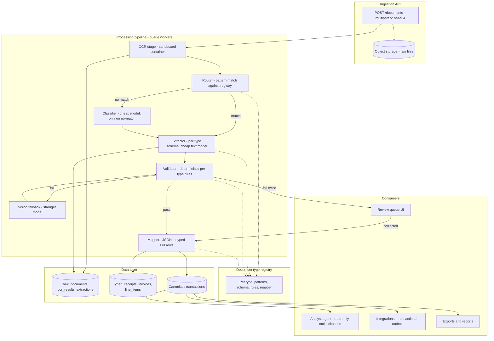
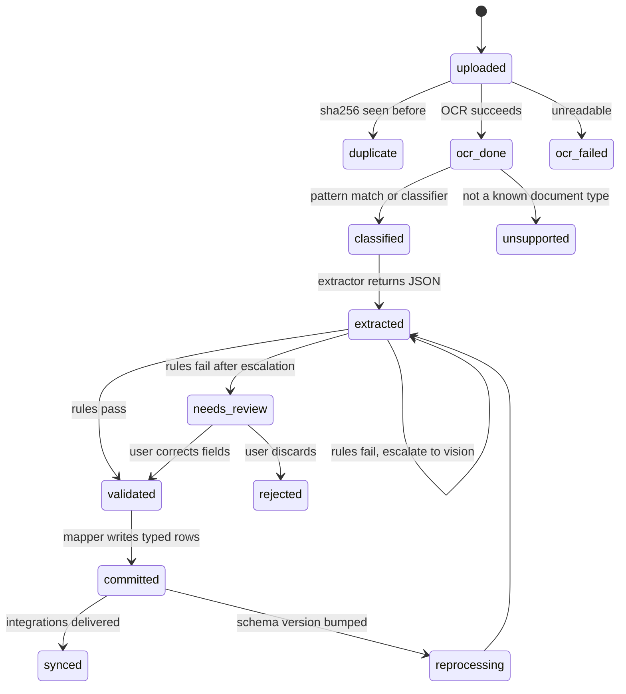
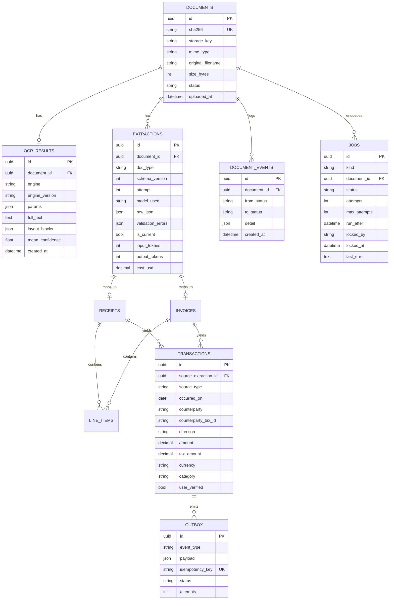

# Ledgerline

**A document ingestion pipeline for small-business finances, with a typed data layer and AI where it's actually needed.**

Upload receipts and invoices. Local OCR reads them, deterministic routing picks the document type, a cheap model extracts JSON against a strict schema, code validates it and writes it into properly typed tables. A read-only analyst agent answers questions with citations back to the original documents. Integrations, exports, and anything else consume the same clean data.

The design principle: **models only where perception or judgment is required.** Everything else is code that can be unit-tested and never hallucinates.

> Status: **phase 1 in progress**. Settings, DB session layer and the phase-1 schema are in;
> upload endpoint, worker and OCR container are next. The results table and demo land here
> once the eval harness exists (phase 3).

> **[Technical design & decision record](docs/DESIGN.md)** — architecture, the full
> decision log with rejected alternatives, measured results, deviations from the original
> plan, and known gaps.

## Why this exists

Most "AI finance assistant" projects put a model in the loop for everything and can't tell you how accurate they are or what a document costs to process. This project is built the other way round:

- Extraction accuracy is **measured per field, per document type, per model tier** on a labeled set
- Most documents never touch an expensive model — cheap extraction first, escalation only when deterministic validation fails
- Every model call is recorded with tokens, cost, and latency
- The analyst never does arithmetic; it calls deterministic tools over a canonical ledger and cites source documents
- Anything that writes state requires human approval

## Architecture



Model calls happen in exactly three boxes — classifier, extractor, vision fallback — and two of them are fallbacks. Everything else is deterministic code.

## Document lifecycle

Every document has exactly one status. Every transition is logged to `document_events`. Every stage is idempotent, so a crashed worker can retry without duplicating anything.



`reprocessing` exists because schemas change and historical documents get re-run from stored OCR text — no re-upload, no re-OCR. `committed` and `synced` are separate because third-party delivery fails independently and must retry without touching the ledger.

## Data model

Three layers. Raw is immutable and versioned. Typed is what integrations map from. Canonical is the only thing the analyst reads.



`documents`, `ocr_results`, `document_events` and `jobs` exist today (phase 1). The typed and
canonical tables — `receipts`, `invoices`, `line_items`, `transactions`, `outbox` — land in
phase 2 and phase 8. `jobs` is the queue: a worker claims a row, so there is no broker to run.

## Document type registry

Adding a document type means adding one module. Nothing else in the pipeline changes.

```python
class DocumentType(Protocol):
    name: str                    # "receipt", "invoice"
    schema: Type[BaseModel]      # what the extractor must return (enforced via tool schema)
    schema_version: int          # bump -> historical documents enter `reprocessing`

    def matches(self, ocr_text: str) -> float: ...           # deterministic, 0.0-1.0
    def extraction_prompt(self, ocr_text: str) -> str: ...
    def validate(self, data: BaseModel) -> list[str]: ...    # deterministic rules
    def map_to_rows(self, data: BaseModel, document_id: str) -> MappedRows: ...
```

Money is `Decimal`, never `float`.

## Roadmap

| Phase | Ships | Demonstrates |
|---|---|---|
| 1 | Upload → sha256 dedup → OCR → stored text; status tracking; event log | Backend fundamentals, idempotency |
| 2 | Registry + `receipt`: routing, schema-enforced extraction, validator, mapper | Core pipeline end to end |
| 3 | Eval harness on labeled receipts; per-field accuracy and cost per document | Measurement before optimization |
| 4 | Vision fallback escalation, review queue with corrections, `invoice` type | Cost engineering, human-in-the-loop |
| 5 | LangGraph orchestration: batch fan-out, conditional edges, interrupt/resume at review, reprocessing | Orchestration where justified |
| 6 | Template-as-code: model generates parsers for recurring vendors in a sandbox, verified before promotion | Removing the model from the hot path |
| 7 | Analyst agent over `transactions`: read-only tools, citations, approval gate; persistent chat | Agent design as a data consumer |
| 8 | Outbox + integrations (CSV, then accounting API); UI with upload, review queue, trace view | Production shape |

Phase 3 comes before phase 5 deliberately: the eval harness exists before the multi-agent layer, so the README can show before/after numbers.

## Stack

- **API:** Python 3.12, FastAPI, SQLAlchemy 2.0, Alembic
- **Tooling:** uv for dependencies and virtualenv, ruff for lint and format, pytest
- **DB:** SQLite (dev, WAL mode) → Postgres
- **Queue:** DB-backed `jobs` table polled by a worker (Redis later if needed)
- **OCR:** self-hosted, behind an `OcrEngine` protocol, in its own container (PP-OCR models on ONNX Runtime; Tesseract as test double)
- **Models:** Anthropic API behind a `ChatProvider` protocol; cheap tier for extraction, strong tier for fallback and analysis
- **Orchestration:** LangGraph (phase 5+)
- **Infra:** Docker Compose

## Design decisions and tradeoffs

- **OCR-first, vision as fallback.** Text extraction is cheaper and more reproducible than vision; routing on OCR text is free. Vision handles the long tail.
- **Per-type schemas, not one universal JSON.** Receipts, invoices, and statements are different shapes with different validation rules and target tables.
- **No code sandbox for extraction.** A model returning JSON through a schema-enforced tool call can't do anything but return JSON. Sandboxing is reserved for parsing untrusted files and for model-generated parser templates (phase 6).
- **Analyst never computes.** Arithmetic lives in deterministic tools. The model interprets and explains.
- **LangGraph is one component, not the architecture.** Provider layer, tool registry, budgets, tracing, and evals all live outside the graph.
- **Sensitive data.** Documents never leave local infrastructure until the extraction step. Encryption at rest and PII redaction before analyst context are planned.

## Local development

Requires [uv](https://docs.astral.sh/uv/) and Python 3.12.

```bash
git clone <this repo>
cd ledgerline
uv sync                            # creates .venv, installs from uv.lock
cp .env.example .env               # ANTHROPIC_API_KEY is only needed from phase 2 on
uv run alembic upgrade head        # creates ./data/ledgerline.db
uv run uvicorn api.main:app --reload
# docs at http://127.0.0.1:8000/docs, health check at /health
```

Lint and tests:

```bash
uv run ruff check .
uv run pytest              # 128 tests, ~1s, no container or tesseract needed
```

Full `docker compose up` instructions land with the OCR container, later in phase 1.

---
