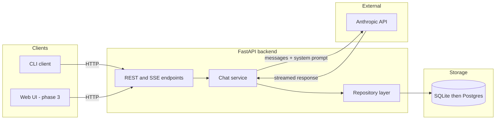
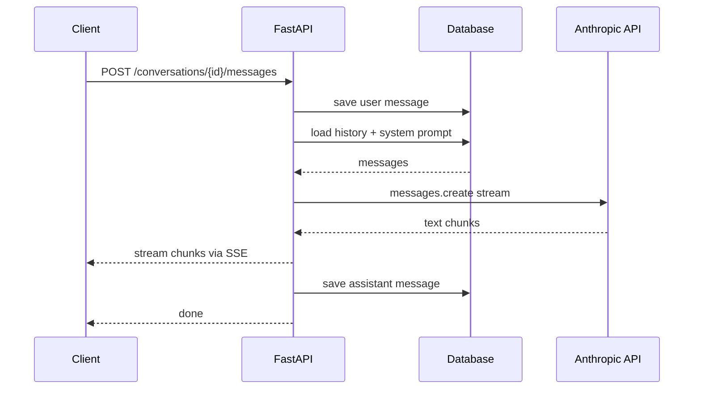
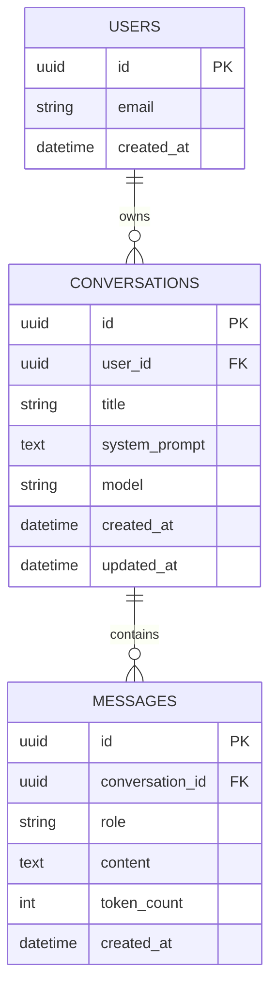

# AI Assistant

A persistent-chat AI assistant built on the Anthropic API.

## System architecture



Clients never talk to Anthropic directly. The API key lives only in the backend. The chat service is the only component that calls the model, and the repository layer is the only component that touches the database.

## Request flow for one message



## Data model



## Roadmap

- Phase 1: CLI chat with persistent conversations (FastAPI + SQLite)
- Phase 2: Streaming responses, conversation management (list, rename, delete)
- Phase 3: Web UI
- Phase 4: Auth, multi-user, Postgres, deployment

---

**If it still shows as plain text after committing**, tell me exactly what you see — e.g. "grey box with the code inside" vs "the words `flowchart LR` in normal text" — and I'll know which of the two failure modes it is. The most common one is an accidental leading space or stray backtick before ` ```mermaid `.

Once the diagrams render, we pick Python vs TypeScript and start on the actual code.
