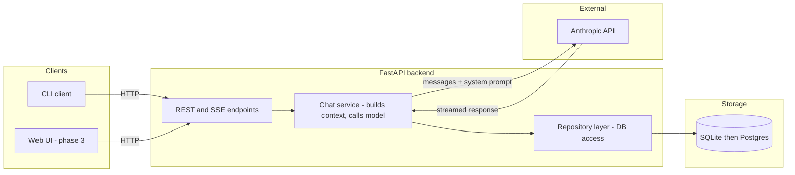

````markdown
# AI Assistant

A persistent-chat AI assistant built on the Anthropic API.

## System architecture



Clients never talk to Anthropic directly. The API key lives only in the backend.

## Request flow for one message

```mermaid
sequence
